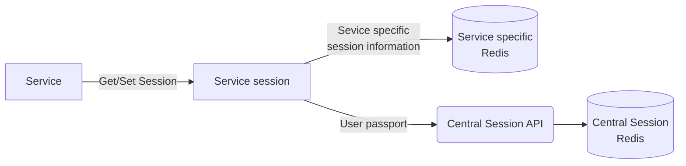

# hmpps-central-session

[](https://operations-engineering-reports.cloud-platform.service.justice.gov.uk/public-github-repositories.html#hmpps-central-session 'Link to report')
[](https://circleci.com/gh/ministryofjustice/hmpps-central-session)


A library for implementing a shared central user session between microservice frontends

## Contents

1. [Building](readme/building.md)
2. [Testing](readme/testing.md)
3. [Maintenance](readme/maintenance.md)
4. [Architecture Decision Records](architecture-decision-record/README.md)
5. [Publishing to NPM](readme/publishing.md)

## Overview

The HMPPS Central Session is used as a wrapper for `express-session` in order to easily allow node applications to use the new [Central Session API](https://github.com/ministryofjustice/hmpps-central-session-api/) so that they may use [micro-frontend components](https://github.com/ministryofjustice/hmpps-micro-frontend-components/) with the correct user information.

### Background

> Something about HMPPS Auth, tokens, etc

### How it works



We split the session up into two separate parts:

- The global session
  - This currently contains the session information that is needed to be accessed across applications
  - Currently this is the users login passport
- The local session
  - This contains all other data for the session that is relevant to just the service

The global session is then sent over to the Central Session API, and the local session saved to the service specific Redis instance.

## Installation

This can be installed from NPM by using

```bash
npm i --save @ministryofjustice/hmpps-central-session
```

## Importing

```ts
import { hmppsSessionBuilder } from '@ministryofjustice/hmpps-central-session'
```

## Usage

### Config options

| Option                     | Description                                                                                    |
| -------------------------- | ---------------------------------------------------------------------------------------------- |
| `cookie`                   | The [cookie options](https://github.com/expressjs/session#cookie) to pass to express-session\* |
| `sessionSecret`            | The secret (or secrets) for signing & verifying the session cookie                             |
| `sharedSessionApi.baseUrl` | The base URL for the central sessions API                                                      |
| `sharedSessionApi.token`   | The authentication token for the central session API                                           |
| `sharedSessionAip.timeout` | The timeout for central session API requests                                                   |

### Logging

You can optionally pass in a logger to the third argument of the session builder in order to see the log for the API Rest Client

### Implementation

To use the HMPPS Session you must first import the builder and initialise it

```ts
import { createRedisClient } from '../redisClient' // This is from the HMMPS Typescript template
import { hmppsSessionBuilder } from '@ministryofjustice/hmpps-central-session'
const redisClient = createRedisClient()
redisClient.connect().catch((err: Error) => logger.error(`Error connecting to Redis`, err))
const options = {
  cookie: { secure: true, maxAge: 120 * 60 * 60 },
  sessionSecret: 'SOME_SECRET_VALUE',
  sharedSesionApi: {
    baseUrl: 'API_URL',
    token: 'SOME_TOKEN',
  },
}

const sessionBuilder = hmppsSessionBuilder(redisClient, options)
```

Once you have this you can use it as middleware for your node application

#### For services

Services have the same service name for every request, this means we can use a single HMPPS Central Session instance for each request

```ts
const router = express.Router()
router.use(sessionBuilder('application-name'))
```

#### For components

Components act slightly differently, they will need to take the name of the service calling them from the request and contruct a new instance of HMPPS Session for each request. For example:

```ts
const router = express.Router()
router.use((req, res, next) =>
  sessionBuilder(req.query.sessionServiceName?.toString() || 'undefined-session-name')(req, res, next),
)
```
